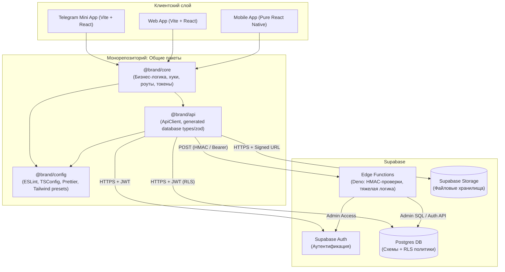

# 00. Обзор архитектуры платформы (High-Level Overview)

Этот документ описывает высокоуровневую архитектуру кросс-платформенной экосистемы (Web, Mobile App, Telegram Mini App), построенной на базе TypeScript, React и Supabase (Postgres + RLS + Edge Functions).

Главная цель этой архитектуры — **максимальный перенос бизнес-логики в общий платформо-агностичный пакет (`core`)** и использование базы данных Supabase напрямую через строго разграниченные политики доступа (RLS), минимизируя или полностью исключая необходимость в написании и поддержке классического backend-сервера.

---

## 1. Высокоуровневая картина взаимодействия

Ниже представлена схема взаимодействия компонентов системы на примере клиентских приложений (TMA, Web, React Native), общих пакетов и сервисов Supabase:

---

## 2. Ключевые свойства архитектуры

### 1. Серверная часть без собственного бэкенда (Serverless / No-Backend)

Вся бизнес-логика разделена между двумя слоями:

- **Слой данных (Postgres):** Валидация инвариантов на уровне таблиц (CHECK-констрейнты, FOREIGN KEY), триггеры для денормализации данных (счетчики лайков, репостов) и политики **Row-Level Security (RLS)** для разграничения прав доступа.
- **Edge Functions (Deno):** Используются исключительно для тех операций, которые невозможно безопасно выполнить на клиенте (например, HMAC-проверка `initData` от Telegram, интеграция со сторонними API с использованием приватных ключей).

### 2. Платформо-агностичный Core-пакет

Пакет `@brand/core` содержит 95% бизнес-логики:

- Не зависит от окружения (DOM API, `react-dom`, специфичных SDK платформ).
- Содержит доменные сущности (с валидацией Zod), бизнес-сервисы, реактивные хуки (через TanStack Query), дизайн-токены и декларативное описание маршрутов.
- Может быть импортирован без изменений в Web-приложение на React, в мобильное приложение на чистом React Native и в Telegram Mini App.

### 3. Единая точка интеграции с данными (ApiClient)

Клиентские приложения общаются с Supabase исключительно через реализацию интерфейса `ApiClient` из пакета `@brand/api`.

- Это позволяет абстрагировать транспортный слой (например, легко заменить `supabase-js` на моки в тестах или перейти на GraphQL/gRPC при необходимости без переписывания `@brand/core`).
- Методы `ApiClient` строго типизированы автогенерируемыми схемами базы данных.

### 4. Единый источник правды для схем

Схема базы данных Postgres является единственным источником правды. Все типы TypeScript и схемы валидации Zod на клиенте автоматически генерируются из работающей схемы базы данных. Изменения схемы автоматически распространяются по монорепозиторию при сборке.

---

## 3. Базовый технологический стек

- **Язык программирования:** TypeScript (strict mode на всех уровнях).
- **Менеджер пакетов:** `pnpm` (с поддержкой workspaces и pnpm 11+ `onlyBuiltDependencies`).
- **Сборщик и локальный сервер:** `vite` (молниеносный сборщик ассетов и HMR сервер разработки).
- **База данных и BaaS:** Supabase (PostgreSQL + RLS + Edge Functions на Deno).
- **Клиентская библиотека БД:** `@supabase/supabase-js`.
- **Генерация схем и типов:** `supazod` (для генерации Zod из таблиц Postgres) + Supabase CLI (для генерации TypeScript-типов).
- **Состояние и кэширование данных:** `@tanstack/react-query` (TanStack Query v5).
- **Роутинг приложений:** `wouter` (ультра-легковесный, производительный декларативный роутер для React-приложений без лишнего оверхеда).
- **Интернационализация (i18n):** `i18next` + `react-i18next` (для гибкого перевода интерфейсов, поддержки плюрализации и ленивой загрузки словарей).
- **Работа с формами:** `react-hook-form` + `@hookform/resolvers` (высокопроизводительные формы без лишней перерисовки, валидируемые через Zod схемы из `core/entities`).
- **Всплывающие уведомления (Toasts):** `sonner` (современная, настраиваемая и красивая библиотека всплывающих уведомлений).
- **Стилизация и UI:** Tailwind CSS (шаринг дизайн-токенов из `@brand/core/tokens`).
- **Иконки:** `lucide-react` (универсальный пак чистых векторных иконок).
- **Валидация:** `zod`.
