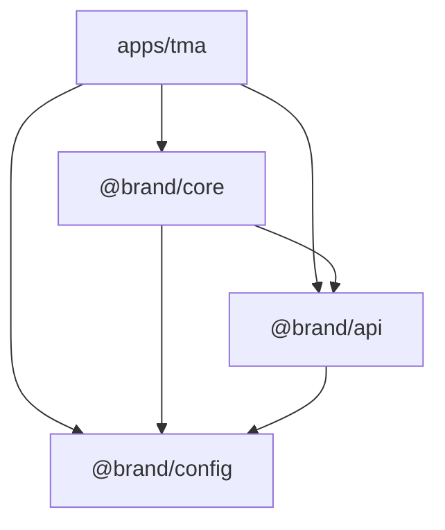

# 01. Структура монорепозитория и зависимости пакетов

Монорепозиторий организован с помощью **`pnpm workspaces`** (поддерживается pnpm версии 11+). Это обеспечивает быструю установку зависимостей, эффективное кэширование модулей (`node_modules`) через жесткие ссылки и строгий контроль импортов между пакетами.

---

## 1. Структура директорий

Универсальный монорепозиторий разделен на два основных каталога:

- `apps/` — конечные собираемые приложения.
- `packages/` — общие библиотеки, дизайн-системы, конфигурации и API-клиенты.

```
wishlist/ (root)
├── apps/
│   ├── tma/                     # Telegram Mini App (Vite + React)
│   ├── web/                     # (Опционально) Web App (React)
│   └── mobile/                  # (Опционально) Mobile App (Pure React Native)
├── packages/
│   ├── core/                    # @brand/core — бизнес-логика, доменные хуки, роутинг
│   ├── api/                     # @brand/api — низкоуровневый клиент Supabase, автогенерация схем
│   └── config/                  # @brand/config — общие конфигурации (eslint, tsconfig, tailwind)
├── supabase/
│   ├── migrations/              # SQL-миграции Postgres
│   └── functions/               # Supabase Edge Functions (Deno)
├── package.json                 # Корневой package.json (команды валидации, линтинга всего репо)
├── pnpm-workspace.yaml          # Конфигурация воркспейса pnpm
└── tsconfig.base.json           # Базовый TypeScript конфиг с path-aliases
```

### Конфигурация `pnpm-workspace.yaml`

Конфигурационный файл в корне определяет, какие папки являются частями воркспейса:

```yaml
packages:
  - 'apps/*'
  - 'packages/*'

# Разрешает запуск native postinstall скриптов только для проверенных зависимостей (pnpm 11+)
onlyBuiltDependencies:
  - unrs-resolver
allowBuilds:
  unrs-resolver: true
```

---

## 2. Границы зависимостей пакетов (Dependency Boundaries)

Для предотвращения «спагетти-архитектуры» и сохранения платформо-агностичности ядра системы действуют строгие архитектурные ограничения на импорты:



### Таблица разрешенных связей

| Пакет-источник           | Может зависеть от                                | Запрещено импортировать                                                                    | Обоснование                                                                                                                                    |
| :----------------------- | :----------------------------------------------- | :----------------------------------------------------------------------------------------- | :--------------------------------------------------------------------------------------------------------------------------------------------- |
| `apps/*` (TMA, Web, App) | `@brand/core`<br>`@brand/api`<br>`@brand/config` | Другие `apps/*` (например, `tma` не может импортировать из `web`).                         | Приложения являются независимыми конечными точками доставки.                                                                                   |
| `@brand/core`            | `@brand/api`<br>`@brand/config`                  | **DOM API**, `react-dom`, `window`, `@telegram-apps/sdk`, любые платформо-специфичные SDK. | Ядро должно быть 100% абстрагировано от среды выполнения, чтобы работать и в браузере, и в Node.js, и на мобильных устройствах в React Native. |
| `@brand/api`             | `@brand/config`                                  | `@brand/core`, `react`, `react-dom`, DOM API.                                              | API-клиент является низкоуровневым инфраструктурным слоем. Он не должен зависеть от бизнес-логики и UI-фреймворка.                             |
| `@brand/config`          | (ничего)                                         | Любые runtime-пакеты.                                                                      | Содержит только файлы конфигураций статического анализа и сборки.                                                                              |

---

## 3. Контроль импортов с помощью ESLint

Для автоматической валидации этих ограничений на уровне CI используется плагин ESLint `no-restricted-imports`.

### Пример правила в `eslint.config.mjs` для `@brand/core`:

```javascript
// packages/core/eslint.config.mjs
export default [
  {
    files: ['src/**/*.{ts,tsx}'],
    rules: {
      'no-restricted-imports': [
        'error',
        {
          paths: [
            {
              name: 'react-dom',
              message:
                'Импорт react-dom в пакете @brand/core запрещен. Этот пакет должен быть платформо-агностичным.',
            },
            {
              name: '@telegram-apps/sdk-react',
              message:
                'Telegram SDK привязан к TMA. Импортируйте его только в apps/tma, передавая нужные параметры через адаптеры в core.',
            },
          ],
          patterns: [
            {
              group: ['**/apps/*'],
              message:
                'Запрещено импортировать код из приложений (apps/*) в общие пакеты (packages/*).',
            },
          ],
        },
      ],
    },
  },
];
```

---

## 4. Наследование конфигурации TypeScript (TSConfig)

Конфигурации TypeScript наследуются от центрального `@brand/config`, чтобы избежать дублирования правил компиляции.

### Шаг 1: `tsconfig.base.json` в корне репозитория

Содержит настройки strict-режима компилятора и глобальные path-aliases для локальной разработки без предварительной сборки:

```json
{
  "compilerOptions": {
    "target": "ES2022",
    "module": "NodeNext",
    "moduleResolution": "NodeNext",
    "esModuleInterop": true,
    "strict": true,
    "skipLibCheck": true,
    "declaration": true,
    "declarationMap": true,
    "sourceMap": true,
    "paths": {
      "@brand/core": ["packages/core/src"],
      "@brand/core/*": ["packages/core/src/*"],
      "@brand/api": ["packages/api/src"],
      "@brand/api/*": ["packages/api/src/*"],
      "@brand/config/*": ["packages/config/*"]
    }
  }
}
```

### Шаг 2: Экспорт TSConfig в `@brand/config`

Пакет `@brand/config` экспортирует готовые профили:

```json
// packages/config/tsconfig/react.json
{
  "extends": "../../../tsconfig.base.json",
  "compilerOptions": {
    "jsx": "react-jsx",
    "lib": ["DOM", "DOM.Iterable", "ES2022"]
  }
}
```

### Шаг 3: Использование в пакетах

Внутри пакетов мы просто расширяем нужный конфиг:

```json
// packages/core/tsconfig.json
{
  "extends": "@brand/config/tsconfig/react.json",
  "compilerOptions": {
    "outDir": "./dist",
    "rootDir": "./src"
  },
  "include": ["src/**/*"]
}
```

---

## 5. Версионирование пакетов

- **Fixed Versioning:** Все внутренние пакеты монорепозитория разделяют единую версию (например, `"version": "0.0.0"`).
- **Workspace Protocol:** Для локальных связей используется протокол `workspace:*`. При публикации или локальной сборке pnpm автоматически заменяет `workspace:*` на актуальную версию пакета.
  ```json
  // В apps/tma/package.json
  "dependencies": {
    "@brand/core": "workspace:*",
    "@brand/api": "workspace:*"
  }
  ```
- Это гарантирует, что разработчик всегда работает с актуальным локальным кодом без необходимости постоянно запускать `npm publish` или `pnpm build` для общих библиотек при локальной отладке.

---

## 6. Фиксированный стек сторонних зависимостей (Approved Tech Stack)

Для обеспечения единообразия, легковесности сборки и высокой производительности во всех клиентских приложениях (`apps/*`) зафиксирован стандартный стек сторонних библиотек. Использование альтернативных решений для аналогичных задач требует предварительного согласования.

### Список одобренных и применимых зависимостей:

| Библиотека                             | Тип / Роль                         | Описание и регламент использования                                                                                           |
| :------------------------------------- | :--------------------------------- | :--------------------------------------------------------------------------------------------------------------------------- |
| **`vite`**                             | Инструмент сборки (Dev Dependency) | Используется как основной быстрый сборщик ассетов и сервер разработки. Все конфигурации расширяют стандартные плагины React. |
| **`wouter`**                           | Маршрутизатор (Routing)            | Минималистичный и производительный роутер. Используется во всех SPA-приложениях вместо тяжелого `react-router-dom`.          |
| **`react-hook-form`**                  | Управление формами (Forms)         | Стандарт для любых форм. Применяется совместно с `@hookform/resolvers` и Zod-схемами сущностей из `@brand/core`.             |
| **`i18next`** <br> **`react-i18next`** | Интернационализация (i18n)         | Единая система перевода интерфейса. Словари локализации хранятся в `@brand/core/i18n` и переиспользуются клиентами.          |
| **`sonner`**                           | Уведомления (Toasts)               | Единственная разрешенная библиотека всплывающих toast-сообщений. Стилизуется в тон общей дизайн-системы.                     |
| **`lucide-react`**                     | Графика (Icons)                    | Единый пак векторных SVG-иконок. Прямой импорт конкретных иконок минимизирует размер итогового бандла.                       |

### Шаблон `package.json` клиентского приложения (например, `apps/tma/package.json`):

```json
{
  "name": "@brand/tma",
  "version": "0.0.0",
  "private": true,
  "type": "module",
  "scripts": {
    "dev": "vite",
    "build": "tsc --noEmit -p tsconfig.json && vite build",
    "preview": "vite preview",
    "typecheck": "tsc --noEmit -p tsconfig.json"
  },
  "dependencies": {
    "@brand/api": "workspace:*",
    "@brand/core": "workspace:*",
    "clsx": "^2.1.0",
    "i18next": "^26.1.0",
    "lucide-react": "^1.14.0",
    "react": "^19.2.0",
    "react-dom": "^19.2.0",
    "react-hook-form": "^7.75.0",
    "react-i18next": "^17.0.0",
    "sonner": "^2.0.7",
    "tailwind-merge": "^3.6.0",
    "tailwind-variants": "^3.2.0",
    "wouter": "^3.9.0",
    "zod": "^4.4.0"
  },
  "devDependencies": {
    "@brand/config": "workspace:*",
    "@tailwindcss/vite": "^4.3.0",
    "@types/react": "^19.2.0",
    "@types/react-dom": "^19.2.0",
    "@vitejs/plugin-react": "^6.0.0",
    "tailwindcss": "^4.3.0",
    "vite": "^8.0.0"
  }
}
```

### Стандартный файл конфигурации Vite (`vite.config.ts`):

Для сборки используется современный Vite v8. Конфигурация включает поддержку плагина React и компилятора CSS-стилей Tailwind v4:

```typescript
import tailwind from '@tailwindcss/vite';
import react from '@vitejs/plugin-react';
import { defineConfig } from 'vite';

export default defineConfig({
  plugins: [react(), tailwind()],
  server: {
    host: '0.0.0.0',
    port: 5173,
  },
  build: {
    target: 'es2022',
    sourcemap: true,
  },
});
```
