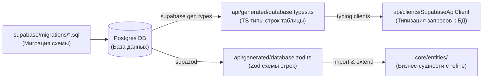

# 02. Слой данных: Supabase, Codegen и API-клиент

Архитектура слоя данных строится вокруг принципа **«Postgres как единственный источник правды»**. Схемы таблиц базы данных автоматически трансформируются в TypeScript-типы и Zod-схемы валидации, которые затем используются по всему монорепозиторию.

---

## 1. Сквозной поток генерации и валидации данных

Вся цепочка изменений данных имеет строгое однонаправленное движение:



1.  **Миграции:** Разработчик пишет SQL-файл в папке `supabase/migrations/`.
2.  **База данных:** Локальная СУБД обновляется.
3.  **Генерация типов (TS):** Утилита CLI генерирует строгие TS-типы таблиц, представлений и функций.
4.  **Генерация схем (Zod):** Утилита `supazod` анализирует БД и строит Zod-схемы для каждой таблицы, учитывая типы полей, nullable-состояния, внешние ключи и перечисления.
5.  **Бизнес-сущности:** Ядро `@brand/core` импортирует эти автогенерируемые Zod-схемы, расширяет их бизнес-инвариантами и формирует финальные доменные типы.

### Команды кодогенерации (из корневого `package.json`)

```json
"scripts": {
  "db:types": "supabase gen types typescript --linked --schema public 2>/dev/null > packages/api/src/generated/database.types.ts",
  "db:zod": "supazod --input packages/api/src/generated/database.types.ts --output packages/api/src/generated/database.zod.ts --schema public",
  "db:codegen": "pnpm db:types && pnpm db:zod"
}
```

> [!WARNING]
> Файлы в папке `packages/api/src/generated/` являются автогенерируемыми. **Никогда не редактируйте их вручную.** Любые ручные правки будут затёрты при следующем запуске генератора.

---

## 2. Инверсия зависимостей: интерфейс `ApiClient`

Вместо того чтобы импортировать клиент `@supabase/supabase-js` прямо в компоненты или хуки, вводится абстракция — интерфейс `ApiClient` в пакете `@brand/api`.

### Зачем это нужно:

1.  **Тестируемость:** Мы можем полностью замокать `ApiClient` в unit-тестах бизнес-логики (`@brand/core/services`) без необходимости поднимать реальную базу данных.
2.  **Заменяемость:** Если в будущем мобильное приложение решит работать через локальную SQLite БД / GraphQL или перейдет на другие эндпоинты, достаточно будет написать новую реализацию `ApiClient` без изменения кода бизнес-логики.
3.  **Безопасность:** Интерфейс скрывает детали реализации Supabase. Код приложения не видит низкоуровневых методов вроде `.select()`, `.insert()`, `.match()`, уменьшая риск совершить некорректный нетипизированный запрос.

### Контракт `ApiClient` (Пример):

```typescript
// packages/api/src/clients/ApiClient.ts
import type { Database } from '../generated/database.types';

export type DbRow<T extends keyof Database['public']['Tables']> =
  Database['public']['Tables'][T]['Row'];
export type DbInsert<T extends keyof Database['public']['Tables']> =
  Database['public']['Tables'][T]['Insert'];

export interface ApiClient {
  auth: {
    signInWithTelegram(initData: string): Promise<{ accessToken: string; userId: string }>;
    signOut(): Promise<void>;
  };
  items: {
    list(params: { ownerId: string }): Promise<DbRow<'items'>[]>;
    create(data: DbInsert<'items'>): Promise<DbRow<'items'>>;
    update(id: string, patch: Partial<DbRow<'items'>>): Promise<DbRow<'items'>>;
    delete(id: string): Promise<void>;
  };
}
```

Реализация `SupabaseApiClient` создается один раз при инициализации приложения (например, в `main.tsx`) и прокидывается в хуки через стандартный React Context (`useApiClient()`).

---

## 3. Конвенция именования полей (snake_case)

В данном стеке принята конвенция **сквозного использования `snake_case` для всех полей сущностей**:

- В базе данных (Postgres): `owner_id`, `created_at`, `photo_storage_path`.
- В сгенерированных типах: `database.types.ts` и `database.zod.ts` оперируют `snake_case`.
- В API-клиенте и бизнес-сущностях ядра (`@brand/core`): сохраняются оригинальные ключи.

### Почему отказались от преобразования в `camelCase` на клиенте?

1.  **Минимизация расхождений:** Отсутствует сложный маппинг (`snakeToCamel` / `camelToSnake`) на границе сетевых запросов.
2.  **Простота отладки:** Поля в DevTools (Network tab), в консоли базы данных, в логах сервера и в TypeScript-коде выглядят абсолютно одинаково.
3.  **Безопасность типов:** Автоматические типы из PostgREST работают "из коробки" без необходимости объявлять кастомные интерфейсы-переводчики на каждый запрос.

---

## 4. Сложные запросы и связывание (Joins): Приоритет RPC-функций

При работе с базой данных напрямую через клиентскую библиоте `supabase-js`, простые выборки из одной таблицы выполняются непосредственно на клиенте с использованием базового синтаксиса (например, `.from('items').select('*')`).

Однако, при необходимости выполнения **сложных выборок, связываний (joins) нескольких таблиц, агрегации или тяжелой фильтрации**, **строгим архитектурным приоритетом является использование хранимых процедур Postgres (RPC - Remote Procedure Calls)** вместо построения длинных и хрупких клиентских цепочек вида `.select('*, profiles(*), comments(*)')`.

### Почему RPC-функции в приоритете для сложных запросов:

1.  **Безопасность типов (Codegen):** При вызове RPC через клиент, тип ответа автоматически и на 100% точно генерируется утилитой `supabase gen types` на основе возвращаемого типа функции в Postgres (`RETURNS TABLE(...)` или `RETURNS SETOF`). Это избавляет от написания и поддержки сложных ручных типов для вложенных объектов (`Nested Joins`) на клиенте.
2.  **Производительность:** База данных компилирует, планирует и выполняет сложные запросы на стороне СУБД значительно быстрее, чем при парсинге сложных URL-запросов PostgREST.
3.  **Безопасность и Инкапсуляция:** Логика связывания скрыта внутри БД. RLS по-прежнему применяется к таблицам, используемым внутри RPC (если функция объявлена как `SECURITY INVOKER`), либо мы можем явно контролировать права доступа через `SECURITY DEFINER` с дополнительными проверками.
4.  **Удобство рефакторинга:** Если структура связанных таблиц изменится, достаточно переписать SQL-код RPC-функции в миграции. API-контракт на клиенте не сломается, а новые типы обновятся автоматически после регенерации.

### Пример создания RPC-функции (в файле миграции):

```sql
create or replace function public.get_items_with_author_details(owner_id_param uuid)
returns table (
  item_id uuid,
  item_name text,
  price numeric,
  author_name text,
  author_avatar text
)
language plpgsql
security invoker -- Функция выполняется с правами вызывающего пользователя (соблюдая все RLS политики)
as $$
begin
  return query
  select
    i.id as item_id,
    i.name as item_name,
    i.price,
    p.full_name as author_name,
    p.avatar_url as author_avatar
  from public.items i
  join public.profiles p on p.id = i.owner_id
  where i.owner_id = owner_id_param;
end;
$$;
```

### Использование в API-клиенте:

```typescript
const { data, error } = await supabase.rpc('get_items_with_author_details', {
  owner_id_param: 'a0eebc99-9c0b-4ef8-bb6d-6bb9bd380a11',
});
// data имеет строгий сгенерированный тип { item_id: string; item_name: string; price: number; ... }[]
```

---

## 5. Принципы Row-Level Security (RLS)

Так как клиентские приложения общаются с Supabase напрямую (без классического бекенда в роли посредника), **RLS является ключевым рубежом безопасности системы.**

### Золотые правила RLS:

1.  **Включить RLS на каждой таблице:** Любая новая таблица с пользовательскими данными по умолчанию должна иметь включенный RLS.
2.  **Force RLS:** Принудительно включить политики даже для владельцев таблиц (`force row level security`), чтобы исключить случайный обход правил.
3.  **Минимум привилегий:** Политики должны быть максимально точечными (раздельные политики для `SELECT`, `INSERT`, `UPDATE`, `DELETE`).

### Шаблон SQL-политик для таблицы:

```sql
-- Включаем RLS на таблице
alter table public.items enable row level security;
alter table public.items force row level security;

-- SELECT: Разрешаем чтение всем авторизованным пользователям
create policy items_select on public.items
  for select using (auth.role() = 'authenticated');

-- INSERT: Пользователь может вставлять строки только со своим owner_id
create policy items_insert on public.items
  for insert with check (owner_id = auth.uid());

-- UPDATE: Изменять строку может только её владелец
create policy items_update on public.items
  for update using (owner_id = auth.uid());

-- DELETE: Удалять строку может только её владелец
create policy items_delete on public.items
  for delete using (owner_id = auth.uid());
```

---

## 5. Тестирование RLS политик

Поскольку RLS — это критический слой безопасности, его необходимо верифицировать.

1.  **В фазе MVP:** Выполняется ручная верификация: вход под Пользователем А и попытка выполнить `UPDATE`/`DELETE` записей Пользователя Б (ожидаемый результат: HTTP 406 / 0 измененных строк).
2.  **В фазе Production:** Создается автоматизированный тестовый набор на базе `Vitest` и тестовых клиентов Supabase с разными JWT (пользовательскими и анонимными), которые проверяют доступность строк на запись и чтение.
