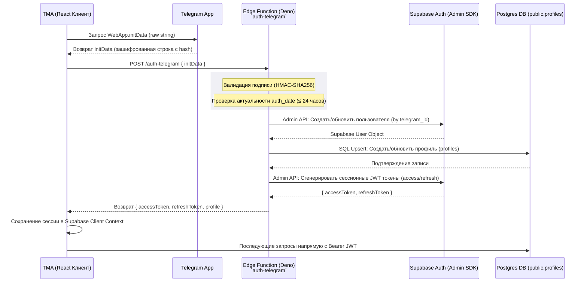

# 04. Безопасная аутентификация: Telegram Mini App и Supabase

Этот документ детально описывает схему сквозной бесшовной аутентификации в Telegram Mini App с использованием криптографической проверки на стороне **Supabase Edge Functions** и последующей выдачи стандартного JWT-токена пользователя Supabase Auth.

---

## 1. Схема потока аутентификации

Взаимодействие клиента, Telegram Cloud, Deno Edge Function и базы данных:



---

## 2. Безопасность на сервере: HMAC-SHA256

> [!IMPORTANT]
> **Никогда не проверяйте подлинность `initData` на клиенте.** Клиентская проверка легко обходится подменой HTTP-запросов или изменением исходного JS-кода в DevTools. Проверка подписи должна происходить исключительно в безопасном серверном окружении.

### Как работает подпись Telegram:

Каждая строка `initData` содержит параметр `hash`, который является HMAC-SHA256 цифровой подписью всех остальных полей данных, отсортированных по алфавиту. Ключом шифрования является секретный `BOT_TOKEN`, выданный BotFather.

### Реализация проверки подписи в Deno Edge Function:

```typescript
// supabase/functions/auth-telegram/_lib/verify.ts
import { crypto } from 'https://deno.land/std@0.224.0/crypto/mod.ts';

export async function verifyTelegramInitData(
  rawInitData: string,
  botToken: string,
): Promise<boolean> {
  const urlParams = new URLSearchParams(rawInitData);
  const hash = urlParams.get('hash');
  if (!hash) return false;

  // 1. Собираем массив строк "key=value" для всех параметров кроме hash
  const dataCheckArr: string[] = [];
  urlParams.forEach((value, key) => {
    if (key !== 'hash') {
      dataCheckArr.push(`${key}=${value}`);
    }
  });

  // 2. Сортируем параметры в алфавитном порядке
  const dataCheckString = dataCheckArr.sort().join('\n');

  // 3. Вычисляем секретный ключ WebApp: HMAC-SHA256("WebAppData", botToken)
  const encoder = new TextEncoder();
  const webAppDataKey = await crypto.subtle.importKey(
    'raw',
    encoder.encode('WebAppData'),
    { name: 'HMAC', hash: 'SHA-256' },
    false,
    ['sign'],
  );

  const secretKeyBuffer = await crypto.subtle.sign('HMAC', webAppDataKey, encoder.encode(botToken));

  // 4. Вычисляем финальный хэш от отсортированных данных с помощью secretKey
  const secretKey = await crypto.subtle.importKey(
    'raw',
    secretKeyBuffer,
    { name: 'HMAC', hash: 'SHA-256' },
    false,
    ['sign'],
  );

  const signatureBuffer = await crypto.subtle.sign(
    'HMAC',
    secretKey,
    encoder.encode(dataCheckString),
  );

  // Преобразуем хэш в hex-строку
  const signatureHex = Array.from(new Uint8Array(signatureBuffer))
    .map((b) => b.toString(16).padStart(2, '0'))
    .join('');

  return signatureHex === hash;
}
```

---

## 3. Логика Edge Function `auth-telegram`

Помимо криптографической проверки подписи, сервер должен выполнить следующие шаги:

1.  **Проверка устаревания:** Сверить параметр `auth_date` из `initData` с текущим временем сервера. Если `initData` сгенерирован более 24 часов назад, отклонить запрос (защита от атак повторного воспроизведения перехваченных пакетов).
2.  **Идемпотентный Upsert пользователя:**
    - Создать или обновить пользователя в служебной схеме `auth.users` через Supabase Admin SDK. В качестве email/логина используется синтетический идентификатор `telegram_<id>@tg.internal`.
3.  **Синхронизация профиля:**
    - Записать актуальные данные пользователя (имя, username, аватар) в таблицу `public.profiles`.
4.  **Выдача сессии:**
    - Сгенерировать и вернуть стандартную пару токенов Supabase.

---

## 4. Стратегия хранения сессии на клиенте (TMA)

В отличие от стандартных веб-сайтов, где сессия хранится в `localStorage` годами, для Telegram Mini App рекомендуется следующая стратегия:

- **Использовать `sessionStorage`:** Принудительно сохранять JWT в `sessionStorage`.
  - _Почему?_ При перезапуске приложения внутри Telegram (после закрытия вкладки) браузерный контекст стирается. Использование `sessionStorage` заставляет приложение повторно запросить свежий `initData` у Telegram SDK и пройти процедуру `signInWithTelegram`.
  - Это гарантирует, что у клиента всегда будет актуальный токен, а сессия не останется висеть «мертвым грузом» на чужом устройстве при смене аккаунта Telegram.
- **Параметр `autoRefreshToken: true`:** Позволяет библиотеке `@supabase/supabase-js` автоматически обновлять `accessToken` в фоне с помощью `refreshToken`, пока Mini App открыт.

---

## 5. Универсальность: Как добавить Web и Mobile

Интерфейс `ApiClient.auth` спроектирован так, чтобы каждая платформа могла реализовать свой метод входа:

```typescript
export interface AuthApi {
  // Для Telegram Mini App
  signInWithTelegram(initData: string): Promise<{ accessToken: string; userId: string }>;

  // Для обычного Web (OAuth2: Google, Apple, Yandex)
  signInWithOAuth(provider: 'google' | 'apple'): Promise<void>;

  // Для мобильных приложений (React Native) или традиционного входа по почте
  signInWithEmailPassword(email: string, password: string): Promise<{ accessToken: string }>;
}
```

### Разделение логики:

- В **TMA** приложение вызывает: `api.auth.signInWithTelegram(WebApp.initData)`.
- В **Web-версии** приложение использует стандартный редирект: `api.auth.signInWithOAuth('google')`.
- В **React Native** используется либо `GoogleSignIn` native-модуль, либо логин/пароль с хранением токена в безопасном системном хранилище Keychain / Keystore (через библиотеки вроде `react-native-keychain`).

Вся остальная бизнес-логика ядра (`@brand/core`), включая получение списков данных и мутации, остается **неизменной**, так как она опирается на один и тот же сессионный JWT-токен авторизованного пользователя.
