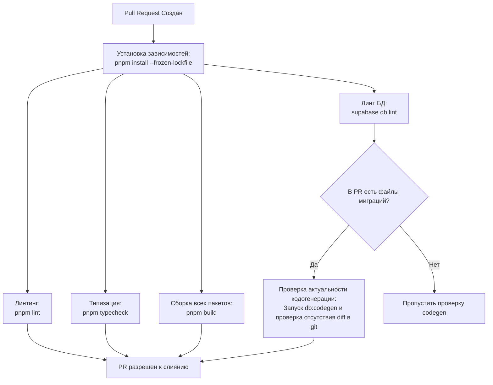

# 06. Операционный цикл: Скрипты, Миграции и CI/CD

Этот документ представляет операционный регламент разработки: описание команд запуска, настроек git-хуков, правил управления миграциями баз данных Supabase и конфигураций пайплайнов автоматического деплоя (CI/CD).

---

## 1. Универсальные скрипты репозитория (`package.json`)

На уровне корня монорепозитория определены глобальные скрипты для управления сборкой, линтингом, тестированием и локальным окружением базы данных:

```json
{
  "scripts": {
    // 1. Запуск в режиме разработки (фильтрует конкретное приложение)
    "dev": "pnpm --filter @brand/tma dev",

    // 2. Сборка всех пакетов воркспейса в параллельном режиме
    "build": "pnpm -r --parallel build",

    // 3. Проверка стилистики кода и автоматическое исправление
    "lint": "eslint .",
    "lint:fix": "eslint . --fix",
    "format": "prettier --write .",
    "format:check": "prettier --check .",

    // 4. Статическая типизация TypeScript по всему репозиторию
    "typecheck": "pnpm -r --parallel typecheck",

    // 5. Запуск юнит-тестов (Vitest)
    "test": "vitest run --passWithNoTests",
    "test:watch": "vitest",

    // 6. Сквозной скрипт локальной валидации кода перед коммитом
    "validate": "pnpm lint:fix && pnpm format && pnpm typecheck && pnpm test",

    // Инициализация хуков husky
    "prepare": "husky",

    // 7. Скрипты Supabase
    "db:link": "supabase link --project-ref \"$SUPABASE_PROJECT_REF\"",
    "db:start": "supabase start",
    "db:stop": "supabase stop",
    "db:reset": "supabase db reset",
    "db:push": "supabase db push",
    "db:diff": "supabase db diff -f",
    "db:types": "supabase gen types typescript --linked --schema public 2>/dev/null > packages/api/src/generated/database.types.ts",
    "db:zod": "supazod --input packages/api/src/generated/database.types.ts --output packages/api/src/generated/database.zod.ts --schema public",
    "db:codegen": "pnpm db:types && pnpm db:zod"
  }
}
```

---

## 2. Git-хуки локального качества (Husky + lint-staged)

Для предотвращения отправки в удаленный репозиторий сломанного или неформатированного кода используются git-хуки `pre-commit`.

### Настройка `pre-commit` хука (`.husky/pre-commit`):

```bash
#!/bin/sh
. "$(dirname "$0")/_/husky.sh"

pnpm lint-staged
```

### Конфигурация `lint-staged` (в корневом `package.json`):

```json
"lint-staged": {
  "*.{ts,tsx,js,jsx,mjs,cjs}": [
    "eslint --fix"
  ],
  "*.{json,md,yml,yaml,css}": [
    "prettier --write"
  ]
}
```

При каждом `git commit` автоматически:

1.  Запускается автофикс линтера только для измененных файлов TS/JS.
2.  Запускается автоформатирование Prettier только для измененных JSON/Markdown/CSS.
3.  Если возникла синтаксическая ошибка линтинга, коммит блокируется.

---

## 3. Архитектура окружений (Environments)

Проект разделен на три изолированных контура:

| Окружение   | База данных                                           | API / Бот                      | Домен            | Назначение                                    |
| :---------- | :---------------------------------------------------- | :----------------------------- | :--------------- | :-------------------------------------------- |
| **`local`** | Локальный докер-контейнер Supabase (`supabase start`) | Локальный бот `@brand_dev_bot` | `localhost:5173` | Ежедневная разработка и написание фич         |
| **`dev`**   | Облачный проект `brand-supabase-dev`                  | Тестовый бот `@brand_dev_bot`  | `dev.brand.app`  | Интеграционное тестирование, автодеплой веток |
| **`prod`**  | Облачный проект `brand-supabase-prod`                 | Продакшн бот `@brand_bot`      | `brand.app`      | Финальный рабочий сервис для пользователей    |

---

## 4. Гибридный рабочий процесс миграций баз данных

Вместо изменений схем таблиц через веб-панель Supabase, мы используем строго декларативный подход:

1.  **Локальные изменения:** Разработчик локально меняет схему базы данных. Для этого он создает новый пустой SQL-файл:
    ```bash
    supabase migration new add_items_status
    ```
2.  **Написание миграции:** Разработчик наполняет созданный SQL-файл в папке `supabase/migrations/` стандартным SQL (например, `ALTER TABLE ... ADD COLUMN ...`).
3.  **Применение локально:** Выполняется накат миграции на локальный докер:
    ```bash
    pnpm db:reset
    ```
4.  **Кодогенерация:** Обновляются типы и Zod-схемы для фронтенда:
    ```bash
    pnpm db:codegen
    ```
    _Сгенерированные файлы TypeScript и Zod должны быть закоммичены в этом же Pull Request._

---

## 5. Конвейер CI/CD (GitHub Actions)

Автоматизация проверок запускается на двух этапах.

### Этап 1: Проверка Pull Request (PR-валидация)

Любой Pull Request в ветку `main` запускает пайплайн статических проверок:



> [!IMPORTANT]
> Если разработчик добавил новую миграцию БД в PR, но забыл запустить `pnpm db:codegen` и закоммитить обновленные TS/Zod-файлы, шаг `VerifyCodegen` упадет на CI с ошибкой diff. Это гарантирует, что типы в репозитории никогда не разойдутся с актуальной схемой БД в продакшене.

### Этап 2: Слияние с веткой `main` (Автодеплой в DEV)

При мердже PR в ветку `main` запускаются следующие действия:

1.  **Накат миграций на DEV БД:** `supabase db push --project-ref $DEV_PROJECT_REF --db-password $DEV_DB_PASSWORD`.
2.  **Деплой Edge-функций в DEV:** `supabase functions deploy --project-ref $DEV_PROJECT_REF`.
3.  **Деплой фронтенда:** Хостинг-провайдер (например, Vercel) автоматически собирает `apps/tma` и деплоит на тестовый домен `dev.brand.app`.

### Этап 3: Публикация релиза (Деплой в PROD)

Деплой на продакшн-контур никогда не запускается автоматически при обычном пуше.

1.  Разработчик создает git-тег версии (например, `v1.0.0`).
2.  Запускается GitHub Actions Workflow с ручным подтверждением (Manual Approval Gate).
3.  После аппрува миграции применяются к продакшн БД Supabase, обновляются Edge-функции, а Vercel переключает трафик основного домена `brand.app` на новый билд.
