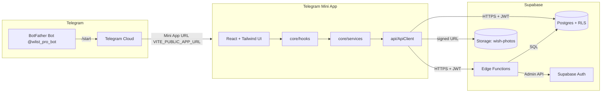
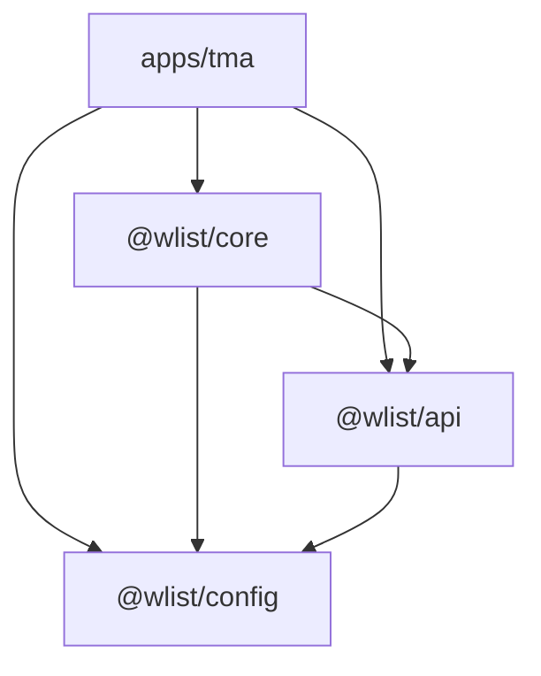
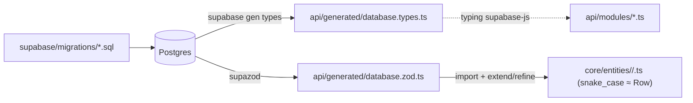
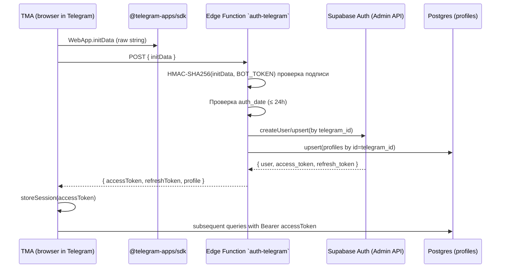
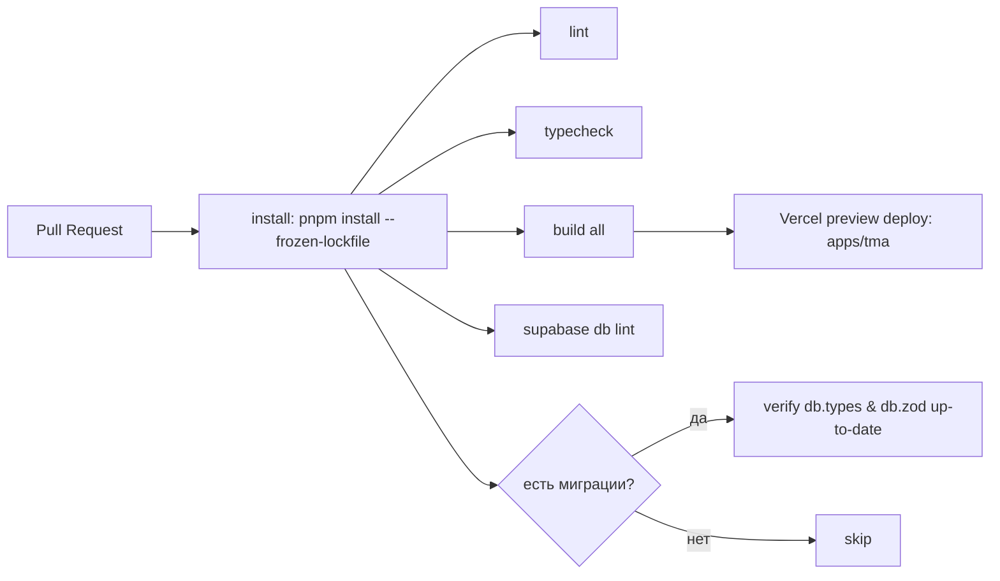

# Архитектура wlist

> Этот документ описывает целевую архитектуру сервиса. Все решения здесь согласованы с [`../plans/README.md`](../plans/README.md). Если возникает расхождение — приоритет у README.

## Содержание

1. [Высокоуровневая картина](#1-высокоуровневая-картина)
2. [Структура моно-репо и зависимости пакетов](#2-структура-моно-репо-и-зависимости-пакетов)
3. [Слои `packages/core`](#3-слои-packagescore)
4. [Слой данных: `packages/api` и Supabase](#4-слой-данных-packagesapi-и-supabase)
5. [Поток аутентификации](#5-поток-аутентификации)
6. [Поток данных запроса/мутации](#6-поток-данных-запросамутации)
7. [Декларативные маршруты в `core`](#7-декларативные-маршруты-в-core)
8. [Дизайн-токены, темы, стилизация](#8-дизайн-токены-темы-стилизация)
9. [Edge Functions: контракты и безопасность](#9-edge-functions-контракты-и-безопасность)
10. [Принципы RLS](#10-принципы-rls)
11. [Миграции и окружения](#11-миграции-и-окружения)
12. [Конвенции CI/CD](#12-конвенции-cicd)
13. [Чек-лист платформо-агностичности `core`](#13-чек-лист-платформо-агностичности-core)
14. [Открытые архитектурные вопросы](#14-открытые-архитектурные-вопросы)

---

## 1. Высокоуровневая картина



**Ключевые свойства:**

- Никакого собственного backend-сервиса в MVP — всё, что нельзя сделать через RLS, реализуется в Edge Functions.
- Bucket `wish-photos` (private): в MVP не более одного изображения на желание; ключ объекта хранится в `wishes.photo_storage_path`.
- TMA общается с Supabase напрямую (через `@wlist/api`), но обёртка `ApiClient` — единственная точка интеграции, чтобы при добавлении web/RN не плодить копии.
- Telegram-бот в MVP — только launcher Mini App. Публичный URL приложения берётся из env (`VITE_PUBLIC_APP_URL`). На старте — временный домен Vercel; после покупки `wlist.pro` он подключается без правок кода.

---

## 2. Структура моно-репо и зависимости пакетов

```
wishlist/
├── apps/
│   └── tma/                   # Telegram Mini App (Vite + React + Tailwind)
├── packages/
│   ├── core/                  # @wlist/core — бизнес-логика, hooks, токены, маршруты
│   ├── api/                   # @wlist/api  — Supabase-клиент, типы из БД, контракты Edge Functions
│   └── config/                # @wlist/config — общие конфиги (eslint, tsconfig, prettier, tailwind preset)
├── supabase/
│   ├── migrations/            # SQL-миграции
│   └── functions/             # Edge Functions (Deno)
├── docs/
│   └── architecture.md        # этот документ
├── plans/
└── pnpm-workspace.yaml
```

### Граф зависимостей пакетов



**Жёсткие правила:**

| Из            | Может зависеть от                                 | Запрещено                                                 |
| ------------- | -------------------------------------------------- | ---------------------------------------------------------- |
| `apps/tma`    | `@wlist/core`, `@wlist/api`, `@wlist/config`       | —                                                          |
| `@wlist/core` | `@wlist/api`, `@wlist/config`                      | DOM API, `react-dom`, Telegram SDK, любые app-специфики    |
| `@wlist/api`  | `@wlist/config`                                    | DOM API, React                                             |
| `@wlist/config` | (ничего)                                         | всё app/runtime-специфичное                                |

> `core` может зависеть от React (хуки, контексты), но **не** от `react-dom` и **не** от платформенных SDK. Эти ограничения проверяются ESLint-правилом `no-restricted-imports`.

### Версионирование

- Все пакеты — **fixed versioning** (одна версия на всю репо). Релиз = единый тэг, синхронные billable-числа.
- Внешние публикации в npm не планируются. Пакеты резолвятся через workspace-протокол: `"@wlist/core": "workspace:*"`.

### Path-aliases и tsconfig

- `tsconfig.base.json` — общий strict-конфиг с `paths`:
  ```jsonc
  {
    "compilerOptions": {
      "paths": {
        "@wlist/core": ["packages/core/src"],
        "@wlist/core/*": ["packages/core/src/*"],
        "@wlist/api": ["packages/api/src"],
        "@wlist/api/*": ["packages/api/src/*"],
        "@wlist/config/*": ["packages/config/*"]
      }
    }
  }
  ```
- В `apps/tma` Vite использует `vite-tsconfig-paths` — так в рантайме и тестах ничего не нужно дублировать.
- Subpath-export `@wlist/core/tokens` оформляется через `package.json` → `"exports"`.

### Скрипты и task-runner

В MVP:

- `pnpm -r --parallel <script>` для базовых команд.
- На уровне репо: `pnpm dev`, `pnpm build`, `pnpm typecheck`, `pnpm lint`, `pnpm test`.
- Turborepo **не вводим в MVP** — добавим, если время сборки/lint станет проблемой (триггер: >30 сек на pre-commit).

---

## 3. Слои `packages/core`

`core` структурирован **по слоям** (а не по фичам), потому что он маленький и весь так или иначе про вишлисты. Внутри каждого доменного слоя (`entities/`, `services/`, `hooks/`) — поддиректория на сущность; рядом с реализацией лежат её юнит-тесты.

```
packages/core/src/
├── entities/        # Zod поверх `database.zod` (уточнения формата); ключи как в БД (snake_case), см. §3
│   ├── profile/
│   │   ├── profile.ts
│   │   ├── profile.test.ts
│   │   └── index.ts
│   ├── wish/
│   │   ├── wish.ts
│   │   ├── wish.test.ts
│   │   └── index.ts
│   ├── slot/
│   │   ├── slot.ts
│   │   ├── slot.test.ts
│   │   └── index.ts
│   └── index.ts
├── services/        # Бизнес-операции; принимают ApiClient через аргумент
│   ├── auth/
│   │   ├── auth.ts
│   │   ├── auth.test.ts
│   │   └── index.ts
│   ├── wishes/
│   │   ├── wishes.ts
│   │   ├── wishes.test.ts
│   │   └── index.ts
│   ├── slots/
│   │   ├── slots.ts
│   │   ├── slots.test.ts
│   │   └── index.ts
│   └── index.ts
├── hooks/           # React-хуки поверх services + TanStack Query, по доменам
│   ├── auth/
│   │   ├── useCurrentUser.ts
│   │   ├── useSignIn.ts
│   │   └── index.ts
│   ├── wishes/
│   │   ├── useMyWishes.ts
│   │   ├── useUserWishes.ts
│   │   ├── useWish.ts
│   │   ├── useCreateWish.ts
│   │   ├── useUpdateWish.ts
│   │   ├── useArchiveWish.ts
│   │   └── index.ts
│   └── slots/
│       ├── useSlots.ts
│       ├── useBookSlot.ts
│       ├── useCancelSlot.ts
│       ├── useMyBookings.ts
│       └── index.ts
├── routes/          # Декларативное описание маршрутов (см. §7)
│   └── routes.ts
├── tokens/          # Дизайн-токены (см. §8)
│   ├── colors.ts
│   ├── spacing.ts
│   ├── radii.ts
│   └── typography.ts
├── i18n/            # Словари переводов + типы ключей (см. §15)
├── lib/             # Платформо-агностичные утилиты (formatPrice, ...)
├── config/          # Constants, query keys factory
│   └── queryKeys.ts
└── index.ts         # Публичный API
```

**Правила вложенности:**

- `entities/`, `services/`, `hooks/` — **всегда по доменам**, одна папка на сущность, даже если внутри один файл. Юнит-тесты лежат рядом с реализацией (`profile.test.ts` рядом с `profile.ts`), а не в отдельном `__tests__/`.
- В каждой папке домена — `index.ts`, который реэкспортит публичный API. Импорт извне идёт через barrel: `@wlist/core/entities/profile`, `@wlist/core/services/wishes`, `@wlist/core/hooks/wishes` — никогда не `…/wishes/wishes` и не `…/wishes/useMyWishes`.
- Если у сущности появляются связанные типы (например, у `slot` — `SlotStatus`, `BookSlotInput`, `CancelReason`) — оставляй их в одном файле `slot.ts`. Когда он превысит ~250 строк, разделяй на `slot/{schema,inputs,statuses}.ts` (а не плоский файл).

### Принципы

- **`entities/`** — валидация и узкие уточнения поверх автогенерированных row-схем из `@wlist/api/generated/database.zod.ts` (см. §4.5). **Ключи остаются как в Postgres (`snake_case`)**, чтобы не дублировать форму строки из `database.types.ts` и не расходиться с ней при миграциях.
  ```ts
  // packages/core/src/entities/wish/wish.ts — nullable `currency` when `price` is null (DB CHECK + superRefine)
  import { publicWishesRowSchema } from '@wlist/api/generated/database.zod';

  export const wishSchema = publicWishesRowSchema
    .omit({ link: true, currency: true })
    .extend({
      link: z.url().nullable(),
      currency: z.string().nullable(),
    })
    .superRefine(/* enforce: price null ⇒ currency null; price set ⇒ supported code */);

  export type Wish = z.infer<typeof wishSchema>;
  ```
  В `packages/api/src/client/` типы строк таблиц **алиасим** к `Database['public']['Tables'][…]['Row' | 'Insert' | 'Update']`, а не копируем поля вручную.
  При добавлении/изменении колонки в миграции и регенерации `database.zod.ts` — TS-сборка падает в `entities/`, пока не поправим `extend`/refine. Расхождения видны на CI.
- **`services/`** — оркестрируют бизнес-операции, не зависят от React. Принимают `ApiClient` через аргумент, возвращают типизированные данные. Здесь живут инварианты: «нельзя забронировать собственное желание», «нельзя удалить wish с активными слотами» и т.д. (плюс зеркальные проверки в БД).
- **`hooks/`** — обёртка над `services`, привязанная к React и TanStack Query. Получают `ApiClient` через `useApiClient()` (см. §4). **Это единственное место, где `core` импортирует React.**
- **`routes/`** — декларативное описание маршрутов (см. §7).
- **`tokens/`** — дизайн-токены (см. §8). Никаких CSS-классов внутри.
- **`lib/`** — функции, которые потенциально могут быть вызваны из любой среды (включая Edge Functions / Node.js).

### Query keys

Централизованная фабрика в `core/config/queryKeys.ts` — единственный источник ключей. Это даёт типобезопасную инвалидацию.

```ts
export const queryKeys = {
  all: ['wlist'] as const,
  currentUser: () => [...queryKeys.all, 'currentUser'] as const,
  wishes: {
    all: () => [...queryKeys.all, 'wishes'] as const,
    byOwner: (ownerId: string) => [...queryKeys.wishes.all(), 'byOwner', ownerId] as const,
    one: (wishId: string) => [...queryKeys.wishes.all(), 'one', wishId] as const,
  },
  slots: {
    byWish: (wishId: string) => [...queryKeys.all, 'slots', 'byWish', wishId] as const,
    myBookings: () => [...queryKeys.all, 'slots', 'myBookings'] as const,
  },
};
```

---

## 4. Слой данных: `packages/api` и Supabase

```
packages/api/src/
├── client/
│   ├── ApiClient.ts        # Интерфейс, описывающий все операции
│   └── SupabaseApiClient.ts # Реализация поверх supabase-js
├── generated/
│   ├── database.types.ts   # supabase gen types (TS-типы row, snake_case)
│   └── database.zod.ts     # supazod (Zod-схемы row, snake_case)
├── modules/                # «Низкоуровневые» функции по доменам
│   ├── auth.ts
│   ├── wishes.ts
│   ├── slots.ts
│   └── storage.ts
├── edge-contracts/         # Zod-схемы request/response Edge Functions
│   └── auth-telegram.ts
└── index.ts
```

### `ApiClient` — точка инверсии зависимостей

Зачем нужен интерфейс:

1. `core` не должен знать про `supabase-js` напрямую — иначе RN-клиент с другим транспортом потребует переписать половину `core`.
2. Тесты `core` подменяют `ApiClient` моком без поднятия реальной БД.
3. Будущий веб-сайт может использовать ту же реализацию или, например, server-side SDK.

```ts
export interface ApiClient {
  auth: {
    signInWithTelegram(initData: string): Promise<{ accessToken: string; userId: string }>;
    signOut(): Promise<void>;
  };
  wishes: {
    list(params: { ownerId: string }): Promise<Wish[]>;
    get(id: string): Promise<Wish | null>;
    create(input: CreateWishInput): Promise<Wish>;
    update(id: string, patch: UpdateWishInput): Promise<Wish>;
    archive(id: string): Promise<void>;
    delete(id: string): Promise<void>;
  };
  slots: {
    list(wishId: string): Promise<WishSlot[]>;
    book(input: BookSlotInput): Promise<WishSlot>;
    cancel(slotId: string): Promise<void>;
    listMyBookings(): Promise<WishSlot[]>;
  };
  storage: {
    requestUploadUrl(input: { wishId: string; mime: string }): Promise<{ uploadUrl: string; storagePath: string }>;
  };
}
```

Реализация `SupabaseApiClient`:

- Создаётся **один раз** в корне приложения (`apps/tma/src/main.tsx`) с конфигом из env.
- Прокидывается через React Context → `useApiClient()` в `core/hooks`.
- Методы валидируют ответ Supabase через Zod-схемы из `core/entities` (защита от расхождения generated-типов и реальной формы данных).

### Именование полей (snake_case по умолчанию)

- **БД и типы из codegen** — `snake_case` (`database.types.ts`, `database.zod.ts`).
- **`ApiClient` для табличных сущностей** — возвращает и принимает те же формы, что и PostgREST (через алиасы к `Database[...]`, без ручного дублирования списка колонок).
- **`core/entities`** — расширяют `public*RowSchema` через `.extend()` / `.refine()`; без обязательного `.transform()` в camelCase.

### 4.5. Generated types и Zod-схемы из Supabase

**Источник правды — схема Postgres.** Из неё мы автогенерируем два артефакта:

| Команда         | Файл                                    | Назначение                                                         |
| --------------- | --------------------------------------- | ------------------------------------------------------------------ |
| `pnpm db:types` | `packages/api/src/generated/database.types.ts` | TypeScript-типы строк/insert/update — для типизации `supabase-js`  |
| `pnpm db:zod`   | `packages/api/src/generated/database.zod.ts`   | Zod-схемы строк (snake_case) — основа для `core/entities`         |

```bash
# package.json scripts
"db:types": "supabase gen types typescript --project-id $SUPABASE_PROJECT_ID > packages/api/src/generated/database.types.ts",
"db:zod":   "supazod --project-id $SUPABASE_PROJECT_ID --output packages/api/src/generated/database.zod.ts"
```

**`supazod`** ([npm](https://www.npmjs.com/package/supazod)) — генерирует Zod-схемы напрямую из Supabase Postgres через introspection, сохраняя точные типы (uuid, jsonb, enum). Альтернатива в случае проблем — `ts-to-zod` поверх `database.types.ts`, но он теряет format-уточнения.

**Поток данных:**



**CI-инварианты:**

- Если PR содержит миграции (`supabase/migrations/*.sql`) — оба `database.types.ts` и `database.zod.ts` должны быть пересгенерированы и закоммичены. CI запускает обе команды и diff-ит.
- Если поле добавлено в БД, но не покрыто в соответствующем `entities/<name>/<name>.ts` (например, забыли расширить схему под новый инвариант) — TypeScript-сборка `core` падает. Это ожидаемое поведение, не баг.

**Никогда не редактируй файлы в `generated/` руками.**

### 4.6. Социальный слой (этап 05, post-MVP)

Таблицы и поля, описанные в [`plans/05-social.md`](../../plans/05-social.md):

- **`public.wish_likes`** — лайк пользователя на чужое желание; PK `(user_id, wish_id)`; каскад при удалении `wishes` / `profiles`.
- **`wishes.reposted_from_id`** — ссылка на оригинал при создании желания через репост; **immutable** после `INSERT` (триггер); `ON DELETE SET NULL` на оригинале.

Типы и Zod для этих объектов генерируются из Postgres (`pnpm db:codegen`); клиентский слой следует инвариантам RLS из миграций.

---

## 5. Поток аутентификации



**Важно:**

- Валидация `initData` — только на сервере. Клиентская проверка обходится за минуту через DevTools.
- Переменная `BOT_TOKEN` живёт в Supabase Function Secrets, не в репо.
- JWT хранится в памяти + (опционально) `sessionStorage`. **Не** localStorage, чтобы при следующем запуске Mini App перелогиниться через свежий `initData`.
- Refresh-токен используем стандартным Supabase-механизмом (`autoRefreshToken: true`).
- При истечении JWT клиент выполняет повторный `signInWithTelegram(initData)`. Это безопасно — тот же `initData` валиден ≤ 24 часов.

---

## 6. Поток данных запроса/мутации

Пример: пользователь открывает экран чужого вишлиста.

```mermaid
flowchart TD
  Page["UserWishlistPage (apps/tma/pages)"] -->|useUserWishes(ownerId)| Hook["useUserWishes (core/hooks)"]
  Hook -->|useApiClient()| Ctx[ApiClientContext]
  Hook -->|useQuery + queryKeys.wishes.byOwner(ownerId)| Query[TanStack Query]
  Query -->|cache miss| Service["wishesService.listByOwner(api, ownerId)"]
  Service -->|api.wishes.list({ ownerId })| Modules["api/modules/wishes.list"]
  Modules -->|supabase.from('wishes').select| DB[(Postgres + RLS)]
  DB -->|rows| Modules
  Modules -->|mapKeys + zod.parse| Service
  Service -->|Wish[]| Query
  Query -->|data| Hook
  Hook -->|data| Page
```

### Мутации и инвалидация

```ts
// core/hooks/useCreateWish.ts
export function useCreateWish() {
  const api = useApiClient();
  const qc = useQueryClient();
  return useMutation({
    mutationFn: (input: CreateWishInput) => wishesService.create(api, input),
    onSuccess: (wish) => {
      qc.invalidateQueries({ queryKey: queryKeys.wishes.byOwner(wish.ownerId) });
      // optimistic insert по желанию — здесь не показано
    },
  });
}
```

Принципы:

- **Один источник истины для query-keys** — `queryKeys` factory (см. §3).
- **Инвалидация рядом с мутацией.** Не размазываем по компонентам.
- **Optimistic updates** — там, где влияют на воспринимаемую отзывчивость (создание желания, бронирование слота). В MVP — там, где это очевидно даёт UX-выгоду.

---

## 7. Декларативные маршруты в `core`

Цель: `core` владеет описанием доступных экранов и их параметров, а каждая платформа сама решает, как их рендерить и навигировать.

```ts
// packages/core/src/routes/routes.ts
import { z } from 'zod';

export const routes = {
  home: route('/', z.object({})),
  myWishlist: route('/me', z.object({})),
  userWishlist: route('/u/:userId', z.object({ userId: z.uuid() })),
  wish: route('/wish/:wishId', z.object({ wishId: z.uuid() })),
  wishCreate: route('/wish/new', z.object({})),
  wishEdit: route('/wish/:wishId/edit', z.object({ wishId: z.uuid() })),
  myBookings: route('/me/bookings', z.object({})),
  profile: route('/me/profile', z.object({})),
} as const;

function route<S extends z.ZodObject<z.ZodRawShape>>(pattern: string, paramsSchema: S) {
  return {
    pattern,
    paramsSchema,
    build: (params: z.infer<S>) => buildPath(pattern, params), // /wish/:wishId → /wish/abc-123
    parse: (url: string) => paramsSchema.parse(matchPath(pattern, url)),
  };
}
```

### Использование на платформе TMA

Каждая платформа реализует свой адаптер. Для TMA в MVP это лёгкий собственный роутер на `history` API + `BackButton` Telegram (внешние роутеры тяжелее интегрировать с `BackButton`):

```ts
// apps/tma/src/router/useRouter.ts
import { routes } from '@wlist/core/routes';

const route = routes.wish;
navigate(route.build({ wishId: 'abc-123' })); // /wish/abc-123
```

При расширении на web/RN эта же таблица переиспользуется через React Router / Expo Router.

**Преимущества:**

- Опечатки в URL ловятся на этапе сборки.
- Параметры всегда валидируются Zod-схемой, а не «на словах».
- Аналитика и deep-links используют те же ключи маршрутов на всех платформах.

---

## 8. Дизайн-токены, темы, стилизация

### 8.1. Дизайн-токены — единый источник правды

`packages/core/src/tokens/`:

```ts
// colors.ts
export const colors = {
  // Базовая палитра (raw)
  brand: { 50: '#...', 500: '#...', 900: '#...' },
  neutral: { 50: '#...', 900: '#...' },
  // Семантические алиасы (используются в Tailwind через CSS-переменные)
  semantic: {
    background: 'var(--tg-theme-bg-color)',
    foreground: 'var(--tg-theme-text-color)',
    muted: 'var(--tg-theme-hint-color)',
    primary: 'var(--tg-theme-button-color)',
    primaryForeground: 'var(--tg-theme-button-text-color)',
    border: 'var(--tg-theme-section-separator-color)',
  },
} as const;

// spacing.ts, radii.ts, typography.ts — plain объекты (числа/строки)
```

### 8.2. Tailwind как основной инструмент

`apps/tma/tailwind.config.ts`:

```ts
import { colors, spacing, radii, typography } from '@wlist/core/tokens';

export default {
  content: ['./src/**/*.{ts,tsx}', '../../packages/core/src/**/*.{ts,tsx}'],
  theme: {
    extend: {
      colors: { ...colors.brand, ...colors.semantic },
      spacing,
      borderRadius: radii,
      fontSize: typography.fontSize,
      lineHeight: typography.lineHeight,
    },
  },
};
```

### 8.3. Telegram-темы

- Telegram передаёт цвета темы через CSS-переменные `--tg-theme-*`.
- Семантические токены (`bg-background`, `text-foreground` и т.д.) маппятся на эти переменные.
- При переключении темы пользователем (light/dark) — Telegram сам обновляет переменные, наш UI меняется без перерисовки.
- Корневой `<html>` получает дополнительные классы `theme-light` / `theme-dark` для случаев, когда нам нужны не-Telegram цвета (брендовые акценты).

### 8.4. Варианты компонентов

`tailwind-variants` (или `cva`) — типизированный API компонентов:

```ts
import { tv } from 'tailwind-variants';

export const button = tv({
  base: 'inline-flex items-center justify-center rounded-md font-medium transition',
  variants: {
    variant: {
      primary: 'bg-primary text-primary-foreground hover:opacity-90',
      ghost: 'bg-transparent text-foreground hover:bg-muted/20',
    },
    size: {
      sm: 'h-8 px-3 text-sm',
      md: 'h-10 px-4 text-base',
    },
  },
  defaultVariants: { variant: 'primary', size: 'md' },
});

export type ButtonVariants = VariantProps<typeof button>;
```

### 8.5. CSS Modules — точечно

Используем **только** там, где утилитами Tailwind становится больно: mesh-градиенты, `@keyframes`, layered glassmorphism, сложные ::before/::after. Файл лежит рядом с компонентом: `Card.module.css`. Импорт классов — через `clsx`, чтобы их можно было смешивать с Tailwind-классами.

### 8.6. Будущая мульти-платформенность

- На web (этап 12) — те же `tokens` + Tailwind, новый набор компонентов под десктоп.
- На RN (этап 12) — решение между NativeWind (`tailwind.config` шарим напрямую) и `StyleSheet` поверх токенов принимаем по итогам опыта с TMA. До тех пор: **никакого UI-кода в `core`**.

### 8.7. Структура UI-слоя TMA (`apps/tma/src`)

**Маршрутные страницы** — одна страница = одна папка под `pages/<route-name>/`: корневой файл страницы (например `WishFormPage.tsx`) плюс всё, что нужно **только** этой странице (локальные подкомпоненты, хуки, утилиты вроде клиентской подготовки файла к загрузке). Если кусок UI или логики понадобится с другой страницы — выносим в общий слой.

**Общие компоненты приложения** — `components/` с **подпапками по уровню сложности**, чтобы не смешивать примитивы и тяжёлые оболочки:

| Папка | Назначение |
| ----- | ---------- |
| `components/primitives/` | Мелкие атомы: кнопки, скелетоны, типографика без бизнес-смысла. Подпапка на виджет (`primitives/button/`, `primitives/skeleton/`). |
| `components/overlays/` | Сложные оболочки: модалки, полноэкранные lightbox, drawer. |
| `components/<domain>/` | Переиспользуемый UI по домену продукта (например `components/wishes/` — карточка списка, превью фото), если он используется с **нескольких** страниц. |

Остальное в `apps/tma/src` без изменений по смыслу: `layout/`, `providers/`, `hooks/` общего назначения, `auth/`, `telegram/`, `api/`, `lib/` (кросс-страничные утилиты без привязки к одному экрану), `router.tsx`, `main.tsx`.

---

## 9. Edge Functions: контракты и безопасность

### 9.1. Где живут

```
supabase/functions/
└── auth-telegram/
    ├── index.ts          # Deno entrypoint
    └── _lib/
        └── verify.ts     # HMAC-валидация initData
```

### 9.2. Контракты

Для каждой функции — Zod-схема в `packages/api/src/edge-contracts/`. Используется одновременно:

- внутри функции для парсинга входа,
- в клиенте для типизации вызова.

```ts
// packages/api/src/edge-contracts/auth-telegram.ts
export const authTelegramRequest = z.object({
  initData: z.string().min(1),
});
export const authTelegramResponse = z.object({
  accessToken: z.string(),
  refreshToken: z.string(),
  profile: profileSchema,
});
export type AuthTelegramRequest = z.infer<typeof authTelegramRequest>;
export type AuthTelegramResponse = z.infer<typeof authTelegramResponse>;
```

### 9.3. Принципы

- **Все секреты — через Supabase Function Secrets**, не через repo.
- **Идемпотентность** — `signInWithTelegram` для существующего пользователя не должен дублировать запись.
- **Минимум прав:** Edge Function использует service-role ключ только если действительно нужно (например, `auth.admin.createUser`). В остальных случаях — JWT пользователя.
- **Логирование без PII:** не пишем `initData` целиком в логи (там телефон, имя).

---

## 10. Принципы RLS

RLS — главный инструмент безопасности. Ниже — конвенции, которые применяем на всех таблицах.

### 10.1. Включаем RLS на каждой таблице с пользовательскими данными

```sql
alter table public.wishes enable row level security;
alter table public.wishes force row level security;
```

`force` — чтобы политики применялись даже к владельцу таблицы (защита от случайного service-role доступа из Edge Function).

### 10.2. Шаблон политик

Для каждой таблицы:

```sql
-- SELECT: см. функцию can_view_wish (этап 08), в MVP — все авторизованные
create policy wishes_select on public.wishes
  for select using (auth.role() = 'authenticated');

-- INSERT: только сам владелец
create policy wishes_insert on public.wishes
  for insert with check (owner_id = auth.uid());

-- UPDATE/DELETE: только сам владелец
create policy wishes_update on public.wishes
  for update using (owner_id = auth.uid());

create policy wishes_delete on public.wishes
  for delete using (owner_id = auth.uid());
```

### 10.3. Скрытие от автора (слоты, комментарии)

Это не «фича», а **инвариант безопасности**. RLS должен исключать `auth.uid() = owner_of(parent)`:

```sql
create policy wish_slots_select on public.wish_slots
  for select using (
    auth.uid() != (select owner_id from public.wishes where id = wish_slots.wish_id)
  );
```

### 10.4. Тестирование RLS

Целевые сценарии для каждой таблицы:

- владелец делает X → разрешено;
- не-владелец делает X → запрещено;
- анонимный пользователь делает X → запрещено;
- для «скрытых от автора» (slots, comments) — автор-владелец на чтение → 0 строк.

**Когда:**

- **До релиза MVP** — только ручная проверка ключевых политик (auth, wishes, slots), особенно «скрытие от автора» в `wish_slots`. Без автоматических тестов.
- **После первой беты** — добавляем автоматический test suite на Vitest + `@supabase/supabase-js` (отдельный проект Supabase или dev). Это требование к выходу из беты в широкий релиз.

---

## 11. Миграции и окружения

### 11.1. Окружения

| Окружение | Supabase проект | Бот                  | Домен                                    | Назначение                          |
| --------- | --------------- | -------------------- | ---------------------------------------- | ----------------------------------- |
| `local`   | (нет)           | `@wlist_pro_dev_bot` | preview Vercel (`*.vercel.app`)          | Разработка веток, preview-деплои    |
| `dev`     | wlist-dev       | `@wlist_pro_dev_bot` | `dev.<vercel-or-domain>`                 | Стабильная dev-ветка, intg-тесты    |
| `prod`    | wlist-prod      | `@wlist_pro_bot`     | временный Vercel-домен → потом `wlist.pro` | Продакшен                           |

> Целевой prod-домен `wlist.pro` пока **не куплен**. На старте используем стандартный домен Vercel; значение хранится в `VITE_PUBLIC_APP_URL` (env). При покупке `wlist.pro` обновляем env + Web App URL в @BotFather, без изменений кода.

### 11.2. Гибридный режим миграций

- Миграции пишем **локально** через `supabase migration new <name>` — получаем SQL-файл в `supabase/migrations/`.
- На каждом PR в CI — проверка линта (`supabase db lint`).
- При мердже в `main` — auto-apply в **dev** через GitHub Actions:
  ```
  supabase db push --project-ref $DEV_REF
  ```
- В **prod** — только ручной запуск (`workflow_dispatch`) с подтверждением.
- Откаты — отдельной миграцией (мы не используем «down»).

### 11.3. Сиды

- `supabase/seed.sql` — минимальный набор данных для локальной/CI-разработки. **Никаких реальных пользователей**.

### 11.4. Изменения схемы и сгенерированные типы/схемы

После каждой миграции локально запускаем **обе** команды:

```bash
pnpm db:types   # → api/generated/database.types.ts
pnpm db:zod     # → api/generated/database.zod.ts
```

CI сверяет: если в PR есть изменение `supabase/migrations/`, оба файла должны быть пересгенерированы и закоммичены. Подробности — в §4.5.

---

## 12. Конвенции CI/CD

### 12.1. На PR



### 12.2. На merge в main

- Apply миграций → dev Supabase.
- Deploy Edge Functions → dev Supabase.
- Vercel auto-promote preview → dev-домен (Vercel-домен на старте, кастомный после покупки).

### 12.3. На release tag

- Apply миграций → prod (с ручным approval).
- Deploy Edge Functions → prod.
- Vercel promote → prod-домен (Vercel-домен на старте, `wlist.pro` после покупки).

### 12.4. Pre-commit (Husky + lint-staged)

- `eslint --fix` на изменённые `.ts/.tsx`.
- `prettier --write` на остальные.
- `pnpm typecheck` на всё (быстро, тк incremental).

### 12.5. Env-переменные и секреты

Хранятся в GitHub Actions secrets и Vercel project envs (раздельно для preview / dev / prod).

**Публичные (попадают в TMA-сборку, префикс `VITE_PUBLIC_*`):**

- `VITE_PUBLIC_APP_URL` — публичный URL приложения (на старте — временный домен Vercel, после покупки — `https://wlist.pro`).
- `VITE_PUBLIC_SUPABASE_URL` — URL Supabase-проекта.
- `VITE_PUBLIC_SUPABASE_ANON_KEY` — anon key Supabase.

**Серверные (только Edge Functions / CI):**

- `SUPABASE_SERVICE_ROLE_KEY` — для админ-операций (создание пользователя при auth-telegram).
- `TG_BOT_TOKEN` — для валидации Telegram `initData`.
- `SUPABASE_DB_URL` — для применения миграций в CI.

---

## 13. Чек-лист платформо-агностичности `core`

Перед каждым merge изменений в `packages/core` ревьюер проверяет:

- [ ] Нет импортов `react-dom`, `window.*`, `document.*`.
- [ ] Нет импортов `@telegram-apps/*`.
- [ ] Нет импортов из `apps/*`.
- [ ] Нет импортов из `packages/api/src/client/SupabaseApiClient` (только из `client/ApiClient` — интерфейс).
- [ ] Все доменные типы выведены из Zod-схем в `entities/`.
- [ ] Любой новый use-case добавлен в `services/`, не сразу в `hooks/`.
- [ ] Если добавлен новый экран — добавлен и маршрут в `routes/`.

ESLint-правило `no-restricted-imports` блокирует основные нарушения автоматически.

---

## 14. Зафиксированные решения и оставшиеся вопросы

### Зафиксированные решения

| Вопрос                              | Решение                                                                                                                       |
| ----------------------------------- | ----------------------------------------------------------------------------------------------------------------------------- |
| **i18n-библиотека**                 | `i18next` + `react-i18next` (см. §15)                                                                                         |
| **Маршрутизация в TMA**             | **`wouter`** в `apps/tma` (History API) + интеграция с Telegram `BackButton`. Полностью кастомный роутер — опционально при росте сложности; альтернатива для data-first сценариев: [`real-router`](https://github.com/greydragon888/real-router) (pre-1.0) |
| **Optimistic updates**              | Делаем по умолчанию для каждой мутации, где есть очевидный UX-выигрыш; в MVP — стартуем с минимума (создание wish, бронь слота), наращиваем по мере |
| **Полное тестирование RLS**        | После первой беты, не до релиза. До релиза — только ручная проверка ключевых политик (auth, wishes, slots)                    |
| **Turborepo**                       | Не вводим. Триггер на добавление: pre-commit > 30 сек или CI build > 5 мин                                                   |
| **NativeWind vs StyleSheet (RN)**   | Решение откладывается до этапа 12                                                                                             |

### Оставшиеся вопросы

1. **Декомпозиция `slots.service.ts`** на момент этапа 03 — возможно, понадобится отдельный `bookings.service.ts` для «моих бронирований». Решим, когда дойдём.

---

## 15. i18n

### 15.1. Библиотека

**`i18next` + `react-i18next`** — зрелый стек, простая интеграция, поддержка namespace'ов и lazy-load переводов на будущее.

### 15.2. Структура переводов

Переводы живут в **`packages/core/src/i18n/`** (а не в `apps/tma`), потому что сообщения нужны и в `services/` (тексты ошибок, имена событий ленты), и в `hooks/`, и позже в RN/Web — все приложения должны разделять словарь.

```
packages/core/src/i18n/
├── locales/
│   └── en/
│       ├── common.json      # Общие тексты, кнопки, статусы
│       ├── wishes.json      # Тексты домена «желания»
│       ├── slots.json       # Тексты домена «слоты»
│       └── errors.json      # Сообщения ошибок (в т.ч. из services)
├── resources.ts             # Сборка ресурсов из locales/*
└── types.ts                 # Типы ключей (для type-safe t('...'))
```

### 15.3. Инициализация

Инициализация `i18n.init()` — **в `apps/tma/src/i18n.ts`** (там, где приложение). `core` экспортирует только словари и типы, без побочных эффектов.

```ts
// apps/tma/src/i18n.ts
import i18n from 'i18next';
import { initReactI18next } from 'react-i18next';
import { resources } from '@wlist/core/i18n';

i18n.use(initReactI18next).init({
  resources,
  lng: 'en',
  fallbackLng: 'en',
  defaultNS: 'common',
  interpolation: { escapeValue: false }, // React уже экранирует
});
```

### 15.4. Type-safe `t()`

Через декларацию модуля `react-i18next`:

```ts
// apps/tma/src/i18n-types.d.ts
import 'react-i18next';
import type { Resources } from '@wlist/core/i18n';

declare module 'react-i18next' {
  interface CustomTypeOptions {
    defaultNS: 'common';
    resources: Resources['en'];
  }
}
```

После этого `t('wishes.title')` → автокомплит и проверка опечаток на этапе сборки.

### 15.5. Конвенции

- **Никаких хардкод-строк в UI.** Любая строка пользователю — через `t(...)`.
- Ключи в `dot.case`, по namespace'ам: `t('wishes.create.title')`.
- Plurals — через стандартный механизм i18next (`{ count }`).
- В `services/` — возвращаем коды ошибок, не локализованные строки. Локализация — в hooks/UI.

### 15.6. Будущие языки

Сейчас только `en`. Когда появится второй язык — кладём `packages/core/src/i18n/locales/<lng>/` и регистрируем в `resources.ts`. Никаких других изменений в коде не требуется.

---

## 16. Стратегия тестирования

Балансируем между «тестами впрок» (вредно для скорости MVP) и «вообще без тестов» (опасно для security).

### 16.1. Пирамида

```
                    ┌────────────────────────────────────┐
                    │ Playwright E2E                      │   1-2 happy-path в MVP
                    │                                     │   расширяем после беты
                    └────────────────────────────────────┘
                  ┌────────────────────────────────────────┐
                  │ Component (Vitest + Testing Library)    │   только сложный UI
                  │                                         │   (формы с условиями) — post-MVP
                  └────────────────────────────────────────┘
              ┌────────────────────────────────────────────────┐
              │ Unit (Vitest)                                    │
              │ • security-critical (валидация подписи и т.д.)   │   с самого MVP
              │ • pure-функции с условной логикой                │
              └────────────────────────────────────────────────┘
        ┌──────────────────────────────────────────────────────────┐
        │ RLS suite (Vitest + supabase-js поверх dev-Supabase)       │
        │ Все таблицы × все политики × все роли                       │   ручное в MVP
        │                                                             │   автомат после беты
        └──────────────────────────────────────────────────────────┘
```

### 16.2. Категории и когда писать

| Категория            | Когда                       | Что тестируем                                                                                       |
| -------------------- | --------------------------- | --------------------------------------------------------------------------------------------------- |
| **A. Unit (security)** | По мере появления фичи в MVP | Валидация Telegram `initData` (HMAC + `auth_date`). Любая будущая Edge Function с проверкой подписи/прав. |
| **A. Unit (pure)**     | По мере появления фичи в MVP | Нетривиальные функции в `core/lib/` и `core/services/` с условной логикой (например, расчёт статуса желания, маппинг гостевого slot). Покрытие — ровно ветви, которые легко сломать. |
| **B. Smoke E2E + ручной QA** | Перед релизом MVP (этап 04) | Playwright happy-path: signin → создал желание → друг забронировал слот. Ручная проверка ключевых RLS. Smoke-вызов Edge Functions из CI. |
| **C. Полный RLS suite + расширенный E2E** | На выходе из беты в широкий релиз | Все таблицы × все политики × все роли. 5–10 E2E-сценариев (бронь, отмена, edit, repost). Sentry. |
| **D. Component**     | Post-MVP, по фактической нужде | Сложные UI-стейты: формы с условиями, мастера, drag-n-drop. Vitest + Testing Library. |
| **D. Realtime smoke**| В этапе 11                  | Что подписка получает события. |
| **D. Bot unit + smoke** | В этапе 10                  | Формирование исходящих сообщений + smoke на webhook. |

### 16.3. Что НЕ делаем

- **Не пишем тесты «впрок»** на тривиальные хуки/компоненты.
- **Не покрываем 100%** — это анти-цель. Покрываем критичные ветви.
- **Не тестируем чужие библиотеки** (TanStack Query, RHF, supabase-js).
- **Не дублируем то, что проверит TypeScript.** Тип не нужно «утверждать» в тесте.

### 16.4. Инструментарий и инфраструктура

- **Vitest** — для unit и component-тестов. Подключаем в этапе 00 (в зависимости), используем по мере возникновения категории A.
- **Testing Library (React)** — добавляем, когда впервые понадобится category D.
- **Playwright** — добавляем в этапе 04, перед релизом.
- **`@supabase/supabase-js`** — для RLS-тестов поверх dev-Supabase. Добавляем перед стартом category C.
- **CI** — отдельные jobs `unit`, `e2e`. Unit падает → блокирует merge всегда. E2E падает → блокирует merge только в `main`.
- **Тесты Edge Functions** запускаем в Deno-runtime (Vitest c `@deno/shim` либо `deno test` — определим, когда напишем первый тест).
