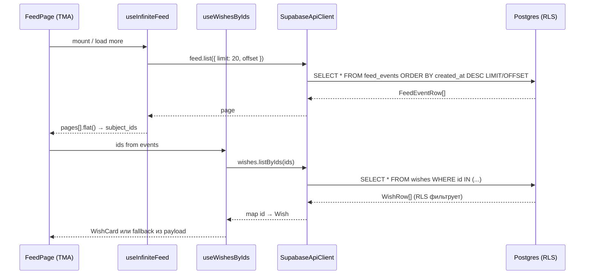

# Как сейчас получаются данные для Feed

Документ описывает **текущую** реализацию экрана «Лента» (`/feed`) на момент этапа 05 (social). Источники: код в репозитории и [`plans/05-social.md`](../plans/05-social.md).

## Кратко

Лента — **двухфазная загрузка**:

1. **События ленты** — пагинированный список строк `feed_events` (что произошло и когда).
2. **Актуальные желания** — batch-запрос `wishes` по `subject_id` из событий, чтобы отрисовать полноценные `WishCard`.

Клиент **не пишет** в `feed_events`: строки создаёт триггер Postgres при `INSERT` в `wishes`.

---

## Схема потока



---

## 1. База данных

### Таблица `public.feed_events`

Append-only журнал: **одна строка на каждое новое желание** (включая репост).

| Колонка      | Тип        | Смысл |
| ------------ | ---------- | ----- |
| `id`         | `uuid` PK  | Id события |
| `actor_id`   | `uuid` FK → `profiles.id` | Кто «автор» события = `wishes.owner_id` |
| `subject_id` | `uuid`     | **`wishes.id`** новой строки |
| `payload`    | `jsonb`    | Снимок на момент создания (для fallback в UI) |
| `created_at` | `timestamptz` | Время события |

Тип в коде: `FeedEventRow` в [`packages/api/src/client/socialTypes.ts`](../packages/api/src/client/socialTypes.ts), сгенерирован из [`packages/api/src/generated/database.types.ts`](../packages/api/src/generated/database.types.ts).

### Как появляются строки (триггер)

Миграция [`supabase/migrations/20260616120000_feed_events_wish_rows_only.sql`](../supabase/migrations/20260616120000_feed_events_wish_rows_only.sql):

- `AFTER INSERT ON public.wishes` → `tg_feed_after_wish_insert()`
- Внутри вызывается `SECURITY DEFINER` функция `append_feed_event(actor_id, subject_id, payload)`
- `payload` собирается так:

```json
{
  "wish_id": "550e8400-e29b-41d4-a716-446655440000",
  "title": "Kindle Paperwhite",
  "owner_id": "6ba7b810-9dad-11d1-80b4-00c04fd430c8",
  "reposted_from_id": null
}
```

Для репоста `reposted_from_id` будет uuid исходного желания.

Клиент **не вызывает** `append_feed_event` (права отозваны у `public`).

### RLS (кто видит события)

По плану [`plans/05-social.md`](../plans/05-social.md):

> Пользователь видит только события тех, на кого подписан, **плюс свои**.

Фильтрация выполняется на стороне Postgres при `SELECT` из `feed_events`; `SupabaseApiClient` не дублирует эту логику.

### Пример строки в БД

```json
{
  "id": "a1b2c3d4-e5f6-7890-abcd-ef1234567890",
  "actor_id": "6ba7b810-9dad-11d1-80b4-00c04fd430c8",
  "subject_id": "550e8400-e29b-41d4-a716-446655440000",
  "payload": {
    "wish_id": "550e8400-e29b-41d4-a716-446655440000",
    "title": "Kindle Paperwhite",
    "owner_id": "6ba7b810-9dad-11d1-80b4-00c04fd430c8",
    "reposted_from_id": null
  },
  "created_at": "2026-05-15T14:30:00.000Z"
}
```

---

## 2. API-слой (`@wlist/api`)

### Контракт

[`packages/api/src/client/ApiClient.ts`](../packages/api/src/client/ApiClient.ts):

```ts
interface FeedApi {
  list(params: { limit?: number; offset?: number }): Promise<FeedEventRow[]>;
}

interface WishesApi {
  listByIds(ids: string[]): Promise<WishRow[]>;
}
```

### Реализация запросов

[`packages/api/src/client/SupabaseApiClient.ts`](../packages/api/src/client/SupabaseApiClient.ts).

**Лента** — `createFeedApi`:

```ts
.from('feed_events')
.select('*')
.order('created_at', { ascending: false })
.order('id', { ascending: false })
.range(offset, offset + limit - 1);
```

- `limit` по умолчанию 20, clamp 1…50
- `offset` по умолчанию 0
- Сортировка: `(created_at DESC, id DESC)` — стабильный порядок при одинаковом времени

**Желания по id** — `wishes.listByIds`:

```ts
.from('wishes').select('*').in('id', chunk); // чанки по 100 id
```

Порядок строк в ответе **не гарантируется** совпадением с порядком `ids`; UI мапит по `row.id`.

### Пример HTTP-уровня (логически)

Запрос 1 — первая страница ленты:

```
GET .../rest/v1/feed_events?select=*&order=created_at.desc,id.desc&offset=0&limit=20
Authorization: Bearer <supabase_jwt>
```

Ответ (массив):

```json
[
  {
    "id": "a1b2c3d4-e5f6-7890-abcd-ef1234567890",
    "actor_id": "6ba7b810-9dad-11d1-80b4-00c04fd430c8",
    "subject_id": "550e8400-e29b-41d4-a716-446655440000",
    "payload": { "title": "Kindle Paperwhite", "wish_id": "550e...", "owner_id": "6ba7..." },
    "created_at": "2026-05-15T14:30:00.000Z"
  }
]
```

Запрос 2 — подтянуть карточки:

```
GET .../rest/v1/wishes?select=*&id=in.(550e8400-...,another-uuid-...)
```

RLS может вернуть **меньше** строк, чем id в запросе (желание скрыто, архивировано для чужого глаза и т.д.).

---

## 3. Core-хуки (`@wlist/core`)

### `useInfiniteFeed`

Файл: [`packages/core/src/hooks/social/useInfiniteFeed.ts`](../packages/core/src/hooks/social/useInfiniteFeed.ts)

| Параметр | Значение |
| -------- | -------- |
| Query key | `queryKeys.feed.infinite()` → `['wlist', 'feed', 'infinite']` |
| Размер страницы | `PAGE = 20` |
| `pageParam` | offset: `0`, `20`, `40`, … |
| Следующая страница | если `lastPage.length < 20` → `undefined`, иначе `allPages.length * 20` |

```ts
useInfiniteQuery({
  queryKey: queryKeys.feed.infinite(),
  queryFn: ({ pageParam }) => api.feed.list({ limit: 20, offset: pageParam }),
  initialPageParam: 0,
  getNextPageParam: (lastPage, allPages) =>
    lastPage.length < 20 ? undefined : allPages.length * 20,
});
```

### `useWishesByIds`

Файл: [`packages/core/src/hooks/wishes/useWishesByIds.ts`](../packages/core/src/hooks/wishes/useWishesByIds.ts)

- Вход: массив `subject_id` из событий ленты
- Дедуп и сортировка id → стабильный cache key `queryKeys.wishes.byIds(sortedUnique)`
- `enabled: sortedUnique.length > 0`
- `placeholderData: keepPreviousData` — при смене страницы ленты старые карточки не мигают
- Каждая строка проходит `wishSchema.parse(withParsedCopyLines(row))` → доменный тип `Wish`

Пример результата в кэше React Query:

```ts
{
  "550e8400-e29b-41d4-a716-446655440000": {
    id: "550e8400-e29b-41d4-a716-446655440000",
    owner_id: "6ba7b810-9dad-11d1-80b4-00c04fd430c8",
    title: "Kindle Paperwhite",
    description: "11th gen",
    price: 149.99,
    currency: "USD",
    link: "https://amazon.com/...",
    photo_storage_path: "user-id/wish-id/photo.jpg",
    is_collaborative: false,
    is_archived: false,
    likes_count: 3,
    reposts_count: 1,
    reposted_from_id: null,
    copy_lines: null,
    created_at: "2026-05-15T14:30:00.000Z",
    updated_at: "2026-05-15T14:30:00.000Z"
  }
}
```

### `useCurrentUser` (для `isOwner` на карточке)

Файл: [`packages/core/src/hooks/auth/useCurrentUser.ts`](../packages/core/src/hooks/auth/useCurrentUser.ts)

На ленте используется только чтобы передать `isOwner={viewerId === wish.owner_id}` в `WishCard`.

### Инвалидация кэша ленты

| Действие | Файл | Что инвалидируется |
| -------- | ---- | ------------------ |
| Создание желания | [`useWishMutations.ts`](../packages/core/src/hooks/wishes/useWishMutations.ts) `useCreateWish` | `queryKeys.feed.infinite()` |
| Follow / Unfollow | [`useFollowMutations.ts`](../packages/core/src/hooks/social/useFollowMutations.ts) | `queryKeys.feed.infinite()` + ключи follows |

Обновление/архивация желания ленту **не** инвалидирует (в ленте остаётся снимок `payload` на момент события — по замыслу этапа 05).

---

## 4. UI — `FeedPage`

Файл: [`apps/tma/src/pages/feed/FeedPage.tsx`](../apps/tma/src/pages/feed/FeedPage.tsx)

### Подключение клиента

```
main.tsx → createApiClient() → ApiClientProvider → FeedPage → useApiClient()
```

[`apps/tma/src/api/createApiClient.ts`](../apps/tma/src/api/createApiClient.ts) создаёт `SupabaseApiClient` с `VITE_SUPABASE_URL` и anon key.

### Сборка списка

```ts
const feed = useInfiniteFeed(api);
const flat = feed.data?.pages.flat() ?? [];
const subjectIds = flat.map((r) => r.subject_id);
const wishMap = useWishesByIds(api, subjectIds);
const profile = useCurrentUser(api);
```

### Рендер одной строки

Для каждого `row` из `flat`:

| Условие | UI |
| ------- | --- |
| `wishMap.data[row.subject_id]` есть | [`WishCard`](../apps/tma/src/components/wishes/WishCard.tsx) с актуальными полями |
| идёт fetch и wish ещё нет | `Skeleton` |
| wish не пришёл (RLS / удалено) | Fallback: `title` из `row.payload`, текст «недоступно», ссылка `/wish/:subject_id` |

Заголовок события всегда один тип: `social.feed.wish_created` + локализованная дата `row.created_at`.

Кнопка «Загрузить ещё» → `feed.fetchNextPage()` при `feed.hasNextPage`.

### Дополнительные запросы на карточке

`WishCard` → [`WishSocialStrip`](../apps/tma/src/components/wishes/WishSocialStrip.tsx):

- Для **чужих** желаний: `useWishLikeState(api, wish.id)` → отдельный запрос `wish_likes` на **каждую** видимую карточку в ленте.
- Для **своих**: лайк скрыт, используется денормализованный `wish.likes_count`.

Счётчики `likes_count` / `reposts_count` на строке `wishes` приходят уже в `listByIds`; отдельного batch API для лайков в ленте нет.

---

## 5. Примеры данных на сквозном пути

### Сценарий: пользователь A подписан на B; B создал желание

1. **INSERT** в `wishes` (owner = B) → триггер пишет `feed_events`.
2. A открывает `/feed` → видит событие (RLS: `actor_id` = B ∈ подписки A).
3. `useWishesByIds` запрашивает wish по `subject_id` → если RLS на `wishes` разрешает — полная карточка.

### Сценарий: событие есть, wish не виден

- Событие в `feed_events` могло остаться (снимок в `payload`).
- `wishes.listByIds` не вернёт строку → fallback с `titleFromPayload(row)`:

```ts
const titleFromPayload = (row: FeedEventRow): string => {
  const p = row.payload as { title?: unknown };
  return typeof p.title === 'string' ? p.title : '';
};
```

### Сценарий: вторая страница

- `offset = 20`, ещё до 20 событий.
- `subjectIds` пересчитывается по **всем** накопленным страницам (`flat`), не только по последней.
- `useWishesByIds` перезапрашивает объединённый набор id (ключ кэша меняется).

---

## 6. Что лента сейчас **не** делает

По [`plans/05-social.md`](../plans/05-social.md) и коду:

- Нет Realtime-подписки на `feed_events` (этап 11).
- В ленте только события **новых желаний** — не слоты, не «собрано», не комментарии.
- Не показывается имя/аватар `actor_id` в шапке строки (только тип события + дата).
- `payload.title` может **расходиться** с актуальным `wishes.title` после редактирования — карточка берёт данные из `wishes`, fallback — из `payload`.

---

## 7. Карта файлов

| Слой | Файлы |
| ---- | ----- |
| Маршрут | [`apps/tma/src/router.tsx`](../apps/tma/src/router.tsx) `/feed` |
| Страница | [`apps/tma/src/pages/feed/FeedPage.tsx`](../apps/tma/src/pages/feed/FeedPage.tsx) |
| Карточка | [`apps/tma/src/components/wishes/WishCard.tsx`](../apps/tma/src/components/wishes/WishCard.tsx) |
| API | [`packages/api/src/client/SupabaseApiClient.ts`](../packages/api/src/client/SupabaseApiClient.ts) (`createFeedApi`, `listByIds`) |
| Типы | [`packages/api/src/client/socialTypes.ts`](../packages/api/src/client/socialTypes.ts) |
| Хуки | [`useInfiniteFeed.ts`](../packages/core/src/hooks/social/useInfiniteFeed.ts), [`useWishesByIds.ts`](../packages/core/src/hooks/wishes/useWishesByIds.ts) |
| Query keys | [`packages/core/src/config/queryKeys.ts`](../packages/core/src/config/queryKeys.ts) |
| БД-триггер | [`20260616120000_feed_events_wish_rows_only.sql`](../supabase/migrations/20260616120000_feed_events_wish_rows_only.sql) |
| Продуктовый скоуп | [`plans/05-social.md`](../plans/05-social.md) § «Лента (Feed)» |

---

## 8. Диаграмма структуры данных в UI

```
feed.data.pages: FeedEventRow[][]
        │
        ▼ flat()
FeedEventRow[]  ──subject_id──►  useWishesByIds  ──►  Record<wishId, Wish>
        │                                    │
        │ payload.title (fallback)           └──► WishCard + WishSocialStrip
        └── created_at (подпись строки)
```
